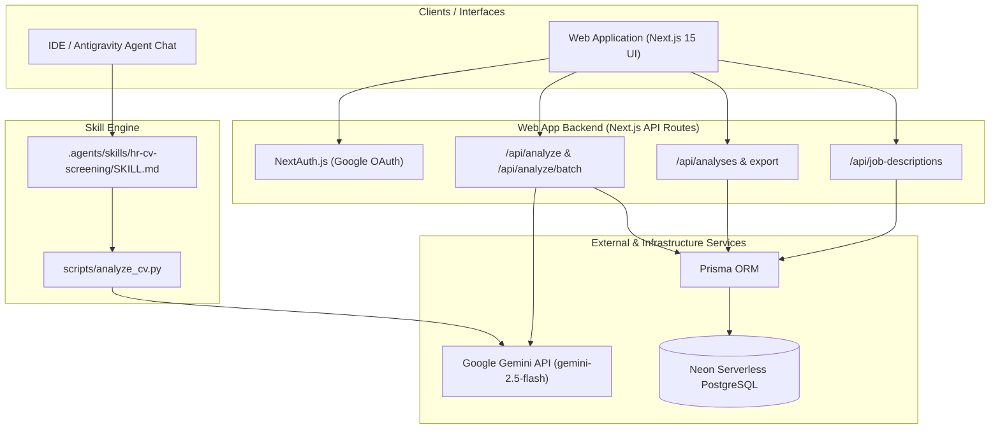
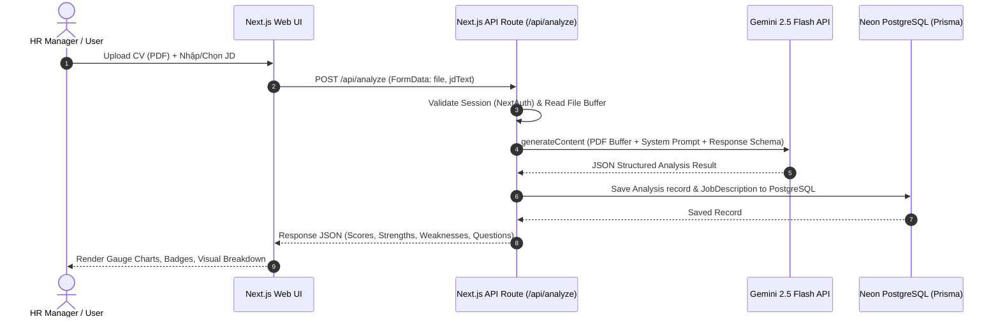

# Architecture Overview — HiLab-HR

Tài liệu kiến trúc tổng quan hệ thống **HiLab-HR (AI-Powered CV Screening System)**.

---

## 1. High-Level Architecture

Hệ thống được thiết kế theo kiến trúc 2 sản phẩm song song:
1. **Antigravity / Claude Skill (`hr-cv-screening`)**: Chạy trực tiếp trong IDE dành cho Developer & Technical Reviewer.
2. **Next.js Fullstack Web App (`hilab-hr`)**: Chạy trên trình duyệt dành cho bộ phận HR Non-tech.

---

## 2. Component Architecture

### 2.1 Skill Architecture (`.agents/skills/hr-cv-screening/`)
- **`SKILL.md`**: Định nghĩa metadata (name, description), quy trình tự động đọc PDF, nạp JD, và kích hoạt script Python.
- **`scripts/analyze_cv.py`**: Sử dụng `google-genai` Python SDK để gửi PDF binary + Prompt JD tới Gemini API, áp dụng Structured Outputs để trả kết quả JSON.
- **`resources/scoring_rubric.md`**: Bộ quy tắc & tiêu chí chấm điểm chuẩn (Kỹ năng 35%, Kinh nghiệm 35%, Học vấn 15%, Tiềm năng & Ngôn ngữ 15%).

### 2.2 Web Application Architecture (`hilab-hr/`)
- **Frontend (React 19 + Next.js 15 App Router)**: UI hiện đại Dark Mode Glassmorphism, Shadcn/UI, Tailwind CSS v4, Lucide Icons.
- **API Handlers (`app/api/`)**: Handle file upload (`FormData`), gửi request tới Gemini, lưu vết và truy vấn cơ sở dữ liệu.
- **Data Access Layer**: Prisma Client kết nối Neon PostgreSQL dạng Serverless Connection Pool.
- **Authentication**: NextAuth.js v5 hỗ trợ Google OAuth 2.0, bảo mật API routes & protected pages.

---

## 3. Data Flow

---

## 4. Key Security & Operational Principles

1. **Server-Side API Key Protection**: `GEMINI_API_KEY` chỉ lưu tại server-side (Next.js API route / `.env`), không bao giờ leak xuống Client UI.
2. **Stateless CV Processing**: CV PDF gốc chỉ được nạp tạm vào bộ nhớ RAM (Buffer) phục vụ phân tích API, không cần lưu trữ vĩnh viễn trên Server Disk/S3, bảo vệ thông tin cá nhân ứng viên (GDPR/Privacy compliant).
3. **Structured AI Outputs**: Ép kiểu dữ liệu Gemini API bằng Pydantic / JSON Schema nhằm đảm bảo 100% kết quả trả về đúng định dạng, không vỡ UI.
