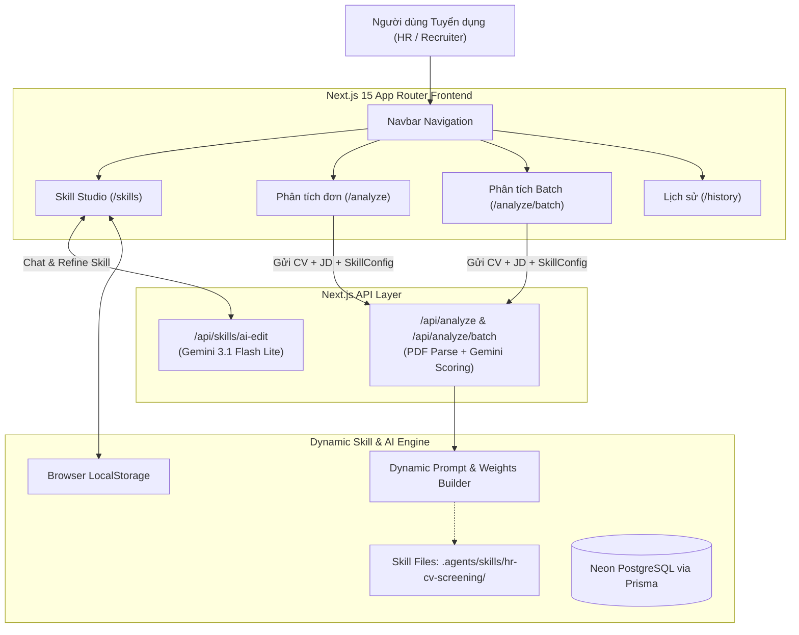

# HiLab-HR System Architecture Overview

## 1. High-Level Architecture

## 2. Core Components
- **Framework**: Next.js 15, React 19, TypeScript
- **Styling**: Tailwind CSS v4, Glassmorphism design system
- **AI Core**: Google Gemini 3.1 Flash Lite (`@google/genai`)
- **PDF Extraction**: `pdf-parse`
- **Excel/Data Export**: `exceljs`
