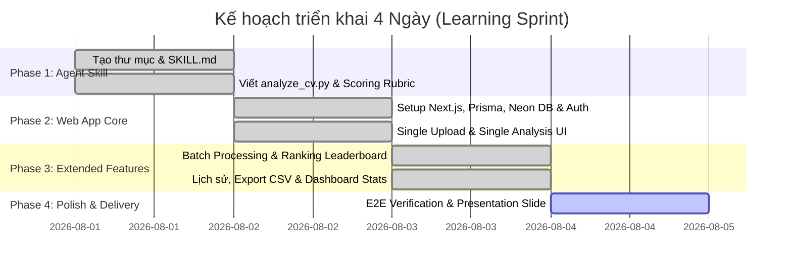

# Implementation Plan: HR CV Screening System (`hr-cv-screening`)

Kế hoạch triển khai kỹ thuật, kiến trúc và quyết định thiết kế cho tính năng **HR CV Screening System**.

---

## 1. Tech Stack Selection

| Layer | Technology | Rationale |
|---|---|---|
| **Framework** | Next.js 15 (App Router) + React 19 | Hiệu năng cao, Server Components, API routes tích hợp sẵn. |
| **Styling & UI** | Tailwind CSS v4 + Shadcn/UI + Lucide Icons | Xây dựng giao diện Dark mode glassmorphism hiện đại, responsive. |
| **History Storage** | Browser LocalStorage | Lưu lịch sử phân tích phía client, không cần database hay authentication. |
| **AI Model SDK** | `@google/genai` (Gemini 2.5 Flash) | Hỗ trợ đọc trực tiếp PDF binary, xử lý tốc độ cao và chi phí tối ưu. |
| **Deployment** | Vercel | Tích hợp liền mạch với Next.js. |

---

## 2. Architectural Decisions & Rationale (ADRs)

### ADR-1: Native PDF Binary Processing với Gemini 2.5 Flash
- **Quyết định**: Gửi trực tiếp Buffer file PDF dạng base64/binary lên Gemini API server-side mà không sử dụng các thư viện parse text PDF trung gian (như `pdf-parse`).
- **Lý do**: Gemini 2.5 Flash hỗ trợ OCR và đọc hiểu layout bản in PDF native (bao gồm bảng biểu, cột trình bày phức tạp trong CV), giúp kết quả phân tích chính xác hơn nhiều so với việc chỉ trích xuất thô dạng text.

### ADR-2: Xử lý hàng chờ Sequential cho Batch Upload Mode
- **Quyết định**: Khi HR chọn batch upload nhiều CV, API và client sẽ gửi/xử lý từng CV nối tiếp (sequential) kèm progress bar cập nhật theo thời gian thực thay vì gọi parallel song song.
- **Lý do**: Tránh hiện tượng chạm ngưỡng Rate Limit (RPM/TPM) của Gemini API và đảm bảo trải nghiệm UI ổn định không bị đứt đoạn giữa chừng.

### ADR-3: Không lưu trữ file CV gốc lên Storage Disk (Stateless Upload)
- **Quyết định**: File CV PDF upload lên server chỉ đọc tạm vào memory Buffer để phục vụ đợt gọi API Gemini, sau đó chỉ lưu chuỗi kết quả phân tích JSON vào Database Neon Postgres.
- **Lý do**: Đảm bảo quyền riêng tư dữ liệu cá nhân của ứng viên (Privacy by Design), tránh phát sinh chi phí lưu trữ Vercel Blob/S3 không cần thiết trong giai đoạn demo.

### ADR-5: LocalStorage cho History thay vì Database
- **Quyết định**: Lưu lịch sử phân tích trong `localStorage` của trình duyệt thay vì Neon PostgreSQL. Không có authentication.
- **Lý do**: Đơn giản hóa triển khai, không cần cấu hình OAuth/DB, phù hợp cho demo sprint. Phân tích vẫn được thực hiện server-side (Next.js Route Handler + Gemini API), chỉ có việc lưu kết quả là client-side.

---

## 3. Implementation Phases & Timeline (4-Day Learning Sprint)

### Chi tiết các giai đoạn:
1. **Ngày 1 (Phase 1)**: Xây dựng hoàn chỉnh Agent Skill trong `.agents/skills/hr-cv-screening/`, viết script Python và test thành công trên IDE.
2. **Ngày 2 (Phase 2)**: Khởi tạo dự án Web Next.js, kết nối Neon DB qua Prisma, cấu hình Google Auth và hoàn thành tính năng phân tích CV đơn lẻ.
3. **Ngày 3 (Phase 3)**: Mở rộng tính năng phân tích đồng loạt Batch mode, bảng xếp hạng ứng viên, lưu lịch sử, xuất báo cáo CSV và làm giao diện Dashboard.
4. **Ngày 4 (Phase 4)**: Tối ưu UI/UX, kiểm thử toàn diện End-to-End, tạo tài liệu hướng dẫn và Slide thuyết trình.

---

## 4. User Review & Prerequisites Checklist

> [!IMPORTANT]
> **Gemini API Key**: Đã tạo và cấu hình thành công `GEMINI_API_KEY` trong `.env` / `.env.local`.

> [!NOTE]
> **Không cần Authentication hay Database**: Ứng dụng chạy hoàn toàn không cần Google OAuth hay Neon DB. Lịch sử được lưu trong LocalStorage trình duyệt.

---

## 5. Out of Scope

- Tích hợp gửi Email tự động thông báo kết quả cho ứng viên.
- Phân quyền nâng cao Multi-tenant / Role-based access control (RBAC).
- Đọc file định dạng DOCX hoặc OCR hình ảnh chụp CV chất lượng thấp.
- Tích hợp trực tiếp với các phần mềm ATS bên thứ ba (Greenhouse, Lever...).
