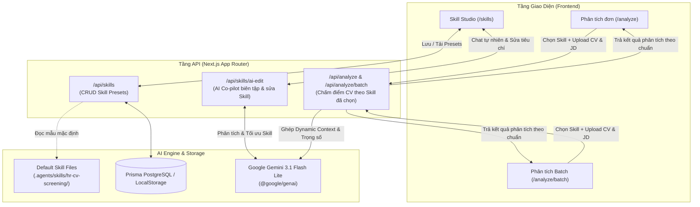

# Design Document: HR Skill Studio & Dynamic Skill-Driven CV Screening

- **Date**: 2026-08-06
- **Status**: Validated & Approved
- **Feature**: HR Skill Studio, AI Co-pilot Prompt/Rubric Editor, and Dynamic Skill-based CV Screening

---

## 1. Executive Summary

Currently, HiLab-HR evaluates candidate CVs using a hardcoded prompt template inside `gemini.ts`. Although the workspace contains a rich skill bundle in `.agents/skills/hr-cv-screening/` (with `SKILL.md`, `scoring_rubric.md`, and weighting rules), this skill was static and not dynamically configurable by users.

This design introduces **HR Skill Studio**:
1. **Dynamic Skill Engine**: Replaces hardcoded prompts with modular, data-driven `SkillConfig` objects initialized from the workspace `.agents/skills/hr-cv-screening/` skill files.
2. **Interactive Skill Studio (`/skills`)**: A dual-pane visual workspace where users can inspect/edit weighting percentages, refine Markdown scoring rubrics, and collaborate with an **AI Co-pilot** in natural language to adjust criteria in real time.
3. **Preset Management**: Allows saving, cloning, and switching between multiple hiring criteria profiles (e.g. *Senior Developer*, *Fresher*, *Sales Lead*) with hybrid storage (LocalStorage + Database persistence).
4. **Seamless Screening Integration**: Single (`/analyze`) and Batch (`/analyze/batch`) screening flows feature an interactive Skill selector to apply targeted evaluation rubrics.

---

## 2. Architecture & Data Flow



---

## 3. Data Model & Type Definitions

### 3.1 `SkillConfig` and `SkillWeights`

```typescript
export interface SkillWeights {
  skills: number;      // Mặc định: 35%
  experience: number;  // Mặc định: 30%
  education: number;   // Mặc định: 20%
  language: number;    // Mặc định: 15%
}

export interface SkillConfig {
  id: string;
  name: string;
  description: string;
  roleInstructions: string;
  scoringRubric: string;
  weights: SkillWeights;
  isDefault?: boolean;
  createdAt?: string;
  updatedAt?: string;
}
```

### 3.2 AI Co-pilot Payload Contract (`/api/skills/ai-edit`)

**Request**:
```json
{
  "currentSkill": {
    "name": "Chuẩn HR CV Screening",
    "description": "Tiêu chí tuyển dụng mặc định",
    "roleInstructions": "...",
    "scoringRubric": "...",
    "weights": { "skills": 35, "experience": 30, "education": 20, "language": 15 }
  },
  "userMessage": "Tăng trọng số kỹ năng lên 40%, thêm tiêu chí bắt buộc về Docker/K8s và hạ học vấn xuống 15%",
  "chatHistory": []
}
```

**Response**:
```json
{
  "success": true,
  "replyMessage": "Tôi đã cập nhật bộ tiêu chí theo yêu cầu của bạn...",
  "changes": [
    "Tăng trọng số Kỹ năng từ 35% lên 40%, giảm Học vấn từ 20% xuống 15%",
    "Bổ sung tiêu chí bắt buộc về Docker/K8s vào mục Kỹ năng"
  ],
  "updatedSkill": {
    "name": "Tuyển dụng Backend DevOps",
    "description": "Tập trung kỹ năng thực chiến và Containerization",
    "roleInstructions": "...",
    "scoringRubric": "...",
    "weights": { "skills": 40, "experience": 30, "education": 15, "language": 15 }
  }
}
```

---

## 4. UI/UX Specification

### 4.1 Skill Studio Page (`/skills`)
- **Top Bar**: Preset selector dropdown, "+ Tạo Preset Mới", "💾 Lưu Thay Đổi", "🔄 Khôi phục Mặc định", "📋 Sao chép Markdown".
- **Left Pane (Skill Inspector & Editor)**:
  - **Tab 1: Trọng số & Cấu hình**: Sliders điều chỉnh `skills`, `experience`, `education`, `language` với thanh kiểm tra tổng 100% (Visual indicator & Auto-balance button).
  - **Tab 2: Markdown Rubric Editor**: Monaco/Textarea editor kèm tab Preview định dạng Markdown.
  - **Tab 3: System Prompt Preview**: Xem trước chuỗi prompt hoàn chỉnh sẽ được gửi tới Gemini.
- **Right Pane (AI Co-pilot Chat)**:
  - Khung chat hội thoại tự nhiên với AI.
  - Quick action suggestion pills (ví dụ: `+ Tăng Kỹ năng lên 40%`, `+ Thêm Soft-skills`, `+ Tối ưu cho Fresher`, `+ Ưu tiên AWS`).
  - Change card hiển thị tóm tắt các điểm vừa được AI sửa đổi kèm nút Hoàn tác (Undo).

### 4.2 Navbar & Screening Pages Integration
- **Navbar**: Thêm mục điều hướng **"Bộ Skills HR"** (icon `Sparkles`).
- **`/analyze` & `/analyze/batch`**: Thêm Dropdown chọn Bộ Skill áp dụng ngay trên form tải lên CV và nút chuyển nhanh sang Skill Studio.

---

## 5. Verification Plan

1. **AI Co-pilot Chat Verification**: Thử nghiệm các prompt thay đổi tiêu chí, kiểm tra tính toán tổng trọng số = 100% và cập nhật Markdown chuẩn xác.
2. **Preset Persistence Verification**: Tạo mới, lưu, sửa, tải lại trang và chuyển đổi preset trên cả LocalStorage và API.
3. **Screening Pipeline Verification**: Chấm điểm CV với 2 preset khác nhau (ví dụ: Preset ưu tiên Kỹ năng vs Preset ưu tiên Học vấn) và đối chiếu điểm thành phần + điểm tổng.
4. **Build & Type Safety**: Chạy `npm run build` thành công, không có lỗi TypeScript hay Lint.
